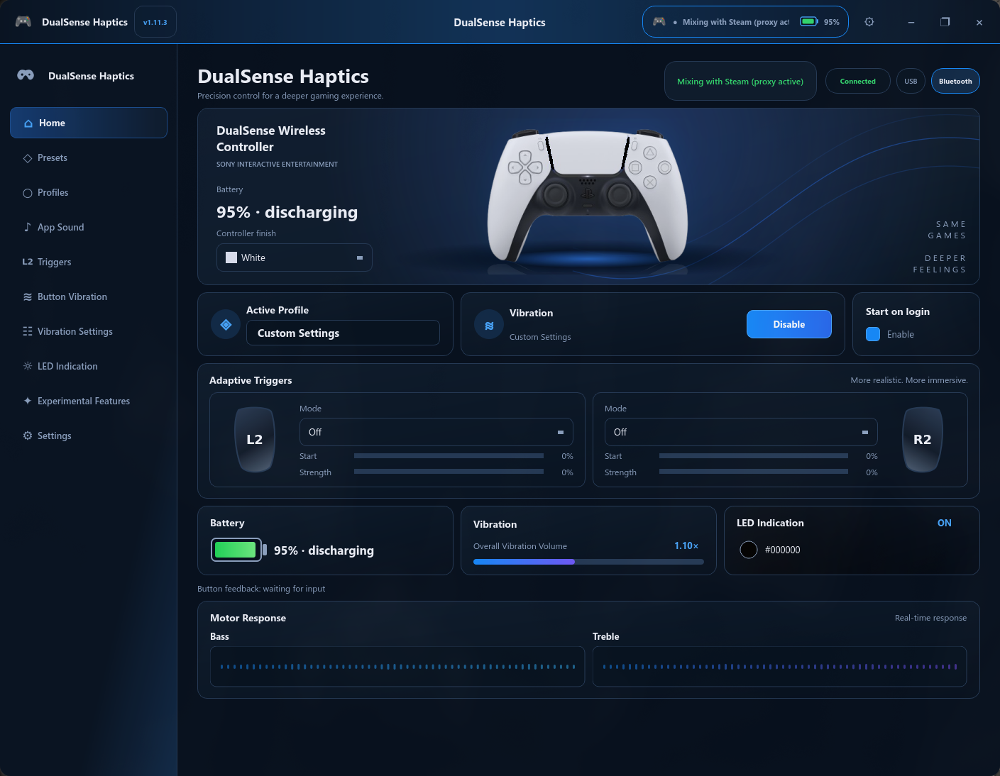

# DualSense Haptics

Audio-reactive haptics and adaptive triggers for the Sony DualSense controller
on Linux, over Bluetooth **or** USB.

Windows has [DSX](https://github.com/Dualsenseify/DSX), which turns your
system audio into rumble on the DualSense's motors. There's no DSX for Linux
— this is that, built from scratch on top of the kernel's own force-feedback
API, with a full GUI on top: presets, per-user profiles, adaptive trigger
effects, per-button haptics, a system tray icon with battery %, autostart,
light/dark/system theming, and 9 languages.



## How it works

The DualSense has no exposed USB Audio interface over Bluetooth, so true
PCM-to-haptics (like DSX claims on Windows) isn't possible over BT on stock
Linux. Instead, this app captures your system's default audio output,
splits it into a bass band and a treble band, and drives the controller's
two rumble motors (`FF_RUMBLE`) with an envelope follower per band — with
noise-gating so a constant background hum doesn't drown out transients like
footsteps or gunshots. It's not literal audio, but it tracks impacts, bass,
and voice noticeably better than a flat "vibrate on any sound" approach.

Adaptive trigger effects (L2/R2 resistance profiles) are applied via
[`dualsensectl`](https://github.com/nowrep/dualsensectl), since they're
one-shot HID reports rather than something worth reimplementing here.

## Features

- **Audio-to-haptics** — band-split bass/treble envelope followers with
  adjustable attack/release, sensitivity, contrast (gamma), and background
  noise suppression, independently for each motor.
- **5 built-in presets** (Balanced, Cinema, Music, Voice & Podcasts, Maximum
  Sensitivity) plus your own saved profiles.
- **Adaptive triggers** — 7 resistance presets (soft resistance, hard wall,
  weapon trigger, bow, machine gun, ratchet, gallop), set independently per
  trigger (L2/R2). If a game is already driving the triggers itself, the app
  detects that the device is held open elsewhere and skips automatically
  re-applying its own effect on reconnect, so it won't fight the game.
- **Per-button haptics** — pick any face button, bumper, trigger click,
  stick click, or the D-pad to buzz lightly while held, mixed with the audio
  vibration, at its own strength, from the motor on that side of the pad.
- **Works over USB or Bluetooth**, with a badge on the home screen showing
  which one is active.
- **System tray icon** with live connection status and battery percentage.
- **Autostart** on login.
- **Light / dark / system theme**, and **9 languages** (English, Russian,
  Chinese, Spanish, German, French, Japanese, Portuguese, Korean) — both
  switchable live from Settings, no restart needed.

## Requirements

- Linux with the kernel's `hid-playstation` driver (mainline since Linux
  5.16; handles both USB and Bluetooth and exposes the controller through
  the standard joystick force-feedback API — no special setup needed beyond
  having a reasonably current kernel).
- Python 3.10+
- [PySide6](https://pypi.org/project/PySide6/) (Qt6 bindings)
- [python-evdev](https://python-evdev.readthedocs.io/)
- PulseAudio or PipeWire with `pipewire-pulse` (needs `parec` on `PATH`)
- [`dualsensectl`](https://github.com/nowrep/dualsensectl) — only required
  for adaptive trigger effects; everything else works without it
- Your user needs read/write access to the controller's `evdev`/`hidraw`
  devices (normally granted via the `input`/`plugdev` group or a udev rule
  that ships with `hid-playstation`-aware distros; if in doubt, check
  `ls -l /dev/input/event*` and `/dev/hidraw*`)

Tested with the regular DualSense and DualSense Edge, over both USB and
Bluetooth.

## Installation

### Arch Linux / pacman

A `PKGBUILD` is included under [`packaging/`](packaging/):

```sh
git clone https://github.com/sendement/dualsense-haptics.git
cd dualsense-haptics/packaging
makepkg -si
```

`dualsensectl` is AUR-only, so `makepkg -si` won't fetch it automatically —
install it first with an AUR helper:

```sh
paru -S dualsensectl   # or: yay -S dualsensectl
```

### Other distributions

No distro packaging beyond the Arch one exists yet — run it from source:

```sh
git clone https://github.com/sendement/dualsense-haptics.git
cd dualsense-haptics

# Debian/Ubuntu-style dependency names, adjust for your distro:
sudo apt install python3 python3-pyside6.qtwidgets python3-evdev pipewire-pulse

python3 main.py
```

Build `dualsensectl` from source if your distro doesn't package it — it's a
small C program with a `Makefile`:

```sh
git clone https://github.com/nowrep/dualsensectl.git
cd dualsensectl && make && sudo make install
```

## Usage

Launch it (`dualsense-haptics` if installed via the package, or
`python3 main.py` from source) and it opens on the **Home** page, showing
connection status, active profile, trigger state, and battery. Pick a
preset under **Presets**, tune things further under **Advanced Settings**,
and save your own combination as a profile under **Profiles**. Adaptive
trigger effects and per-button vibration live on their own pages. Theme and
language are under **Settings**.

Closing the window minimizes it to the tray rather than quitting — use the
tray icon's context menu to reopen, toggle vibration, or quit. Check
**Autostart** in the sidebar to have it launch minimized to tray on login
(pass `--tray` manually to start minimized without going through autostart).

## Limitations

- No literal PCM playback through the motors over Bluetooth — see
  [How it works](#how-it-works). Audio quality of the haptic response
  depends on the DSP tuning in **Advanced Settings**, not a 1:1 waveform.
- Vibration/button-haptics needs the controller to expose a force-feedback
  `evdev` interface, which requires `hid-playstation`; very old kernels
  won't have it.
- Adaptive triggers depend on `dualsensectl` being installed; without it,
  everything else still works.
- Built and tested on Arch/Hyprland; should work anywhere with a recent
  kernel and PipeWire/PulseAudio, but other desktop environments and
  distros haven't been extensively tested.

## License

[MIT](LICENSE)
